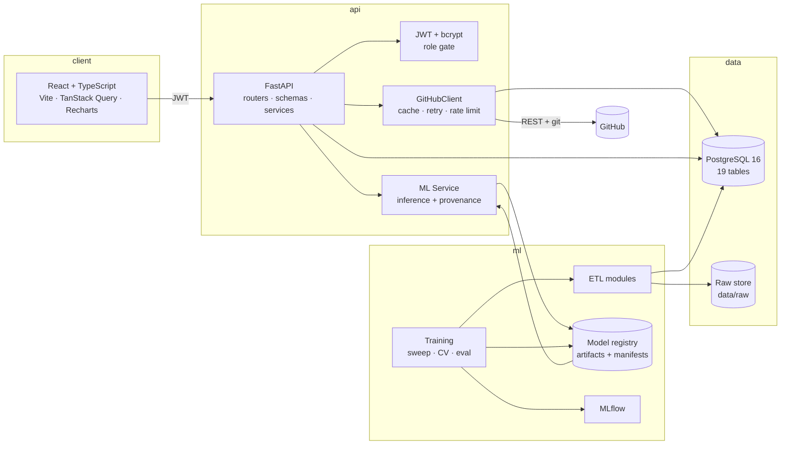

# DevInsight

**AI-Powered Software Engineering Analytics & Predictive Intelligence Platform**

DevInsight ingests real GitHub repository history, engineers features from it, trains and
evaluates four machine-learning models, and serves them through a REST API and an
interactive dashboard — with full experiment tracking, reproducible artefacts, and
documented label limitations.

```
GitHub (REST + git transport)  →  ETL  →  PostgreSQL  →  feature engineering  →  ML training
                                        │                                     │
                                        └────────── analytics API ◄───── model registry
```

---

## Table of contents

1. [Problem statement](#1-problem-statement)
2. [Features](#2-features)
3. [Architecture](#3-architecture)
4. [Tech stack](#4-tech-stack)
5. [Dataset](#5-dataset)
6. [Data pipeline](#6-data-pipeline)
7. [ML algorithms](#7-ml-algorithms)
8. [Feature engineering](#8-feature-engineering)
9. [Model evaluation](#9-model-evaluation)
10. [API documentation](#10-api-documentation)
11. [Database schema](#11-database-schema)
12. [Getting started](#12-getting-started)
13. [Docker setup](#13-docker-setup)
14. [CI/CD](#14-cicd)
15. [Deployment](#15-deployment)
16. [Testing](#16-testing)
17. [Screenshots](#17-screenshots)
18. [Future improvements](#18-future-improvements)

---

## 1. Problem statement

Engineering teams sit on a lot of data — commits, pull requests, issues, releases,
reviews — and turn almost none of it into decisions. Spreadsheet reporting is slow,
historical, and structurally incapable of answering forward-looking questions. The
questions managers actually ask are predictive:

- *Will this pull request introduce a defect?*
- *What kind of issue is this, so it routes to the right place?*
- *How urgent is this, really?*
- *How much effort will resolving this take?*

DevInsight answers those with models, not dashboards. The interesting engineering problem
is not the API — it is that **none of these labels exist in the data.** GitHub does not
record whether a change was defective, how urgent an issue truly is, or how many hours it
took. So the real work is deriving defensible proxy targets from observable history,
measuring honestly, and documenting exactly what each proxy cannot see.

## 2. Features

**GitHub integration**
- Repository URL ingestion with an SSRF guard (only `github.com` accepted)
- Repositories, commits, per-file diffstats, pull requests, issues, labels, issue
  comments, contributors and releases
- ETag/`Last-Modified` response caching, token-aware rate-limit tracking, exponential
  backoff, retry on transient errors, `Link`-header pagination
- Idempotent writes (natural unique keys + `ON CONFLICT`), so a re-run never duplicates
  rows and never re-hits GitHub for data already stored
- An ingestion job ledger: rows written, API calls made, duration, errors

**ETL pipeline**
- Repeatable extract → clean → transform → feature-engineer → validate → train
- Separate modules per stage, with a caching raw store under `data/`
- Airflow DAG for scheduled runs (optional Docker profile)

**Analytics** — repository, developer and project-trend metrics, aggregated in
PostgreSQL with `date_trunc` and window functions rather than in Python.

**Four trained models** — defect risk, issue classification, issue priority, effort
estimation. Every prediction reports the model version that produced it and is written to
an append-only audit log with its input hash.

**Platform** — JWT auth with roles, pagination, uniform error envelope, correlation ids,
redacting logger, interactive OpenAPI docs, MLflow experiment tracking, Docker Compose
stack, GitHub Actions CI/CD.

**Teams and code-access control** — a project manager owns a team, chooses its members,
and grants that team specific repositories. Two independent inputs decide what any
person can do, and both must agree:

- their **global role** (`admin` / `analyst` / `viewer`) sets a *ceiling*;
- a **repository grant** — to them directly, or to a team they belong to — decides
  *which* repositories are visible at all.

```
effective(user, repo) = min(role_ceiling, max(all applicable grants))
                        read < write < admin
```

So a project manager administers the repositories their team was granted and **nothing
else**; an `analyst` in a team holding `admin` gets `write`; a member can be pinned to a
single repository inside their team; and revoking a team's grant revokes it for everyone
at once, because access is revoked by default rather than granted by exception. Every
repository route resolves through one access service, and
`GET /api/teams/access/me` explains any person's own access in plain language.

## 3. Architecture

Full specification: **[`docs/ARCHITECTURE.md`](docs/ARCHITECTURE.md)**



### Design rules enforced in code

1. Route handlers contain no business logic and make no GitHub or ML calls.
2. `services/github_client.py` is the **only** module that knows about tokens,
   pagination, ETag caching or rate limits.
3. Every prediction records its model version, probability and input hash.
4. Training is reproducible: seeded, with a manifest recording data hash, features,
   hyper-parameters, metrics and library versions.
5. No invented metrics. Every number in the UI is read from MLflow or the database at
   runtime.

## 4. Tech stack

| Layer | Technology | Why |
|---|---|---|
| API | FastAPI 0.115, Pydantic v2 | Async, validation, auto-generated OpenAPI |
| ORM / DB | SQLAlchemy 2.0, PostgreSQL 16, Alembic | Typed relationships, real constraints, window functions |
| GitHub | httpx + `git` transport | REST for metadata; git for full history (not rate-limited) |
| ML | scikit-learn, XGBoost, NumPy, pandas | Baseline sweep + strong tabular baseline |
| MLOps | MLflow | Experiment tracking, params/metrics/artifacts |
| Serialisation | joblib + `manifest.json` | Fast, versioned, self-describing |
| Frontend | React 18, TypeScript, Vite | Typed contracts, fast builds |
| Data fetching | TanStack Query | Caching, retries, invalidation |
| Charts | Recharts | Composable React charts |
| Auth | JWT (PyJWT) + bcrypt | Stateless, horizontally scalable |
| CI/CD | GitHub Actions | Lint → test → build → deploy |
| Orchestration | Airflow 2.9 (optional profile) | Industry-standard DAG scheduling |

## 5. Dataset

All real, all publicly available, all reproducible.

| Source | Content | Acquisition |
|---|---|---|
| `pallets/click` | 3,380 commits | `git clone` — full history, real diffstats |
| `psf/requests` | 6,736 commits | `git clone` |
| `pallets/flask` | 5,598 commits | `git clone` |
| `encode/httpx` | 1,643 commits | `git clone` |
| `expressjs/express` | 6,428 commits | `git clone` |
| **Total** | **23,784 commits, 41,358 file changes** | |
| Public issue corpus | 3,569 real GitHub issues (title, body, labels, comments, timestamps) | public dataset mirror |

**Two different counts, and the difference matters.** The 23,784 commits above are the
complete cloned history, and they are what the models were **trained** on. The
application database is populated by `scripts/seed_local.py`, which keeps the **900 most
recent commits per repository** so the demo stays quick — so PostgreSQL holds **4,513
commits and 14,259 file changes**, which is what every number on the dashboard is
computed from. Nothing is fabricated; the database is a deliberate recent slice of the
same real history. Raise `MAX_PER_REPO` in that script and re-run it to load more.

**Why two sources.** The git transport gives the *complete* per-file diffstat history
(LOC, authorship, timing) that the REST API only approximates. The issue corpus carries
the *text and labels* that git history cannot. Using the REST API for bulk history would
also be impractical — the unauthenticated quota is 60 requests/hour and `pallets/click`
alone has 3,377 commits.

```bash
python ml/data/acquire.py     # clone repos + download corpus (idempotent)
```

## 6. Data pipeline

```
GitHub REST API + git clone
        │  EXTRACT
        ▼
data/raw/repos/*              real git history
data/raw/github_issues.jsonl  real issue objects
        │  ml/data/{github_history,issue_corpus}.py
        ▼
data/processed/               cleaned commits, file changes, releases
        │  ml/preprocessing/clean_history.py
        │    · drop unusable rows, normalise authorship
        │    · derive fix-intent, hour, weekday, log-scaled churn
        │    · build the defect target (bug-inducing-change proxy)
        │  ml/preprocessing/clean_text.py
        │    · strip code, HTML, URLs, e-mails, issue refs
        ▼
        │  ml/features/{defect_features,issue_features}.py
        │    · 49 leakage-guarded change features
        │    · TF-IDF + 22 structured features for the issue models
        │    · derive category / priority labels from real label vocabulary
        ▼
data/features/                processed datasets
        │  ml/training/*.py
        ▼
model sweep → cross-validation → held-out test → manifest + report
        │
        ▼
ml/artifacts/<model>/v<n>/    model.joblib · manifest.json · comparison.json
ml/reports/                   human-readable evaluation reports
```

**Leakage control.** Every historical feature is computed in a single forward pass per
repository over commits sorted by time, using only strictly prior events. A commit's
features cannot observe anything at or after it. This is asserted by a regression test
that recomputes the matrix with extra future commits appended.

**Scheduling.** `airflow/dags/devinsight_etl.py` runs ingest → feature rebuild → retrain
→ artefact verification → API health check every six hours.

## 7. ML algorithms

Full methodology and label limitations: **[`docs/ML.md`](docs/ML.md)**

### Model 1 — Software defect risk (binary → LOW/MEDIUM/HIGH)

- **Unit of analysis:** one real commit. **Target:** the bug-inducing-change proxy — a
  commit is positive if a *different* author, within 30 days, fixes the same paths with a
  fix-intent commit.
- **Features:** 49 — change size (log-scaled), message signal, timing, file composition
  and class, author history, repository activity windows, per-file history.
- **Candidates compared:** Logistic Regression · Random Forest · Gradient Boosting ·
  XGBoost. Selected on 5-fold stratified CV macro-F1.
- **Output:** risk band (`LOW < 0.33 ≤ MEDIUM < 0.66 ≤ HIGH`) plus a calibrated
  probability, the contributing factors with their model weights, and the model version.

### Model 2 — Issue classification (6 classes)

TF-IDF (word 1–2-gram ⊕ char\_wb 3–5-gram) → Linear SVM with sigmoid calibration, and
Logistic Regression as the alternative. Classes: `BUG`, `FEATURE_REQUEST`,
`DOCUMENTATION`, `QUESTION`, `ENHANCEMENT`, `OTHER`. Labels derived from real repository
label vocabulary; rows with no derivable signal are **dropped, not guessed**.

### Model 3 — Issue priority (4 classes)

`CRITICAL` / `HIGH` / `MEDIUM` / `LOW`. Hybrid representation: TF-IDF over the issue
title ⊕ 22 structured features (label severity, comment volume, stack-trace detection,
critical-language detection, length, author association). The API response and the UI
both carry an explicit **advisory disclaimer** — this is a model estimate, human triage
decides priority.

### Model 4 — Development effort (regression)

Estimates resolution time in hours with an interval derived from the measured IQR of
absolute test residuals. Trained on `log1p(resolution_hours)`; all metrics reported on
the original hour scale. Evaluated with **MAE, RMSE, R²**, plus within-±20 % and
within-2× hit rates.

**The stated limitation:** GitHub records no engineering hours. Time-to-close includes
queue and wait time, so this is a coarse proxy for hands-on effort — surfaced in the API
response, the UI and the documentation.

## 8. Feature engineering

Full breakdown in [`docs/ML.md`](docs/ML.md#3-feature-engineering). Summary:

- **Leakage-safe history features** — author commit count and defect rate, repository
  activity windows (7d/30d), per-file change count and defect rate, tenure, time since
  previous commit. All expanding-window over prior events only.
- **Heavy-tail handling** — `log1p` on all line counts; bounded rates; median imputation
  computed without crossing the split.
- **Signal filtering** — lockfiles, vendored trees, generated artefacts and changelogs are
  excluded from the defect-label path set, because churn there is not evidence of a defect.
- **Text normalisation** — strips code blocks, HTML, URLs, e-mails, quotes and markdown
  syntax; masks issue references (which appear everywhere and carry no signal).
- **Title weighting** — the title is repeated in the TF-IDF document so short informative
  titles are not drowned out by long bodies.

## 9. Model evaluation

**Every metric is measured on a held-out test split and read from the artefact manifest
at runtime. Nothing is hard-coded.**

- Classification: accuracy, precision, recall, F1 (binary + macro), balanced accuracy,
  confusion matrix, per-class report, ROC-AUC.
- Regression: MAE, RMSE, R², median AE, MAPE, within-±20 %, within-2×.
- **Model comparison** is generated from the real sweep and rendered in the UI
  (`GET /api/ml/models/comparison`):

  | Model | Accuracy | Precision | Recall | F1 | CV score | Train time | Selected |
  |---|---|---|---|---|---|---|---|
  | *(populated from the actual run — see `ml/reports/`)* | | | | | | | |

- Human-readable reports: `ml/reports/<model>_v<n>.md`.
- **CI gate:** `python tests/test_artifacts.py` fails the build if a model is untrained,
  undocumented, uncompared, or if a metric falls outside a plausible range — which is how
  a hard-coded placeholder gets caught.

Reproduce:

```bash
cd ml && python training/run_all.py
python tests/test_artifacts.py
```

## 10. API documentation

Interactive: `http://localhost:8000/docs` · Full reference:
**[`docs/API.md`](docs/API.md)**

| Method | Path | Purpose |
|---|---|---|
| `GET` | `/api/health` | Liveness + dependency status |
| `POST` | `/api/auth/register` · `/api/auth/login` | Issue a JWT |
| `GET` | `/api/auth/me` | Current profile |
| `POST` | `/api/repositories/analyze` | Ingest a GitHub URL (idempotent) |
| `GET` | `/api/repositories/{id}` | Detail + health score |
| `GET` | `/api/repositories/{id}/analytics` | All repository metrics |
| `GET` | `/api/repositories/{id}/health` | Five scored health indicators |
| `GET` | `/api/repositories/{id}/trends` | `?granularity=daily\|weekly\|monthly` |
| `GET` | `/api/repositories/{id}/contributors` | Contributor leaderboard |
| `GET` | `/api/repositories/{id}/commits` · `/issues` · `/pull-requests` · `/releases` | Paginated facts |
| `POST` | `/api/ml/defect-risk` | LOW/MEDIUM/HIGH + probability |
| `POST` | `/api/ml/classify-issue` | 6 categories + confidence |
| `POST` | `/api/ml/predict-priority` | 4 levels + disclaimer |
| `POST` | `/api/ml/estimate-effort` | Hours + interval |
| `POST` | `/api/ml/classify-batch` | Bulk classification |
| `GET` | `/api/ml/models` · `/models/comparison` | Registry + comparison tables |
| `GET` | `/api/ml/evaluation/{name}` | Full evaluation report |
| `GET` | `/api/ml/predictions` | Prediction audit log |
| `GET` | `/api/jobs/{id}` | Ingestion job status |
| `GET` | `/api/teams` · `/teams/{id}` | Your teams, with members and repository grants |
| `POST` | `/api/teams` | Create a team; you become its project manager |
| `POST` | `/api/teams/{id}/members` | Add a member as `manager` / `member` / `viewer` |
| `PATCH`/`DELETE` | `/api/teams/{id}/members/{user_id}` | Change role or scope / remove |
| `POST` | `/api/teams/{id}/access` | Grant the team a repository (`read`/`write`/`admin`) |
| `DELETE` | `/api/teams/{id}/access/{grant_id}` | Revoke it for the whole team |
| `GET` | `/api/teams/access/me` | Everything you can reach, and how |

## 11. Database schema

ER diagram: **[`docs/DATABASE.md`](docs/DATABASE.md)**

19 normalised tables. The 16 analytical tables — `users`, `repositories`, `contributors`,
`commits`, `file_changes`, `pull_requests`, `issues`, `issue_labels`, `issue_label_map`,
`issue_comments`, `releases`, `predictions`, `model_versions`, `ml_runs`,
`analytics_snapshots`, `refresh_jobs` — plus the three access-control tables `teams`,
`team_members` and `repository_access`.

- No mega-JSON blobs — `JSONB` only where the shape is genuinely open (metrics,
  parameters, explanations).
- Natural composite unique keys (`commits(repository_id, sha)`,
  `issues(repository_id, number)`, …) make ingestion idempotent.
- Indexes on every FK, plus `(repository_id, authored_at DESC)` for time series and a GIN
  full-text index on issue text.
- PostgreSQL ENUMs persisted by value, so a raw `SELECT` is self-documenting.
- `repository_access` stores a grant to a person and a grant to a team in one table, with
  a CHECK constraint enforcing that exactly one of `user_id` / `team_id` is set, so
  "who can touch this repository" is a single indexed query.
- Drift gate: `python backend/scripts/check_schema.py` compares the live schema to the ORM
  and exits non-zero on any difference in tables, columns, **column nullability** or
  primary keys.

## 12. Getting started

### Prerequisites

Python 3.12+ · Node 20+ · Docker 24+ (or a local PostgreSQL 16) · `git`

### Option A — Docker (everything at once)

```bash
cp .env.example .env
# generate a real secret; the stack refuses to start without one
echo "SECRET_KEY=$(openssl rand -hex 32)" >> .env
# optional but recommended: raises the GitHub quota from 60 to 5000 req/hour
echo "GITHUB_TOKEN=ghp_xxx" >> .env

docker compose up -d --build
```

| Service | URL |
|---|---|
| Web dashboard | http://localhost:8080 |
| API + Swagger | http://localhost:8000/docs |
| MLflow UI | http://localhost:5000 |

Train the models once so the ML endpoints respond:

```bash
docker compose exec api python ml/training/run_all.py
```

With the Airflow scheduler:

```bash
docker compose --profile airflow up -d
```

### Option B — local development

```bash
git clone <repo> devinsight && cd devinsight
cp .env.example .env && echo "SECRET_KEY=$(openssl rand -hex 32)" >> .env

pip install -r backend/requirements.txt
npm --prefix frontend install

# 1. database
docker run -d --name devinsight-pg -p 5432:5432 \
  -e POSTGRES_USER=devinsight -e POSTGRES_PASSWORD=devinsight \
  -e POSTGRES_DB=devinsight postgres:16-alpine
cd backend && alembic upgrade head && cd ..

# 2. real data + models  (~10 minutes)
python ml/data/acquire.py
cd ml && python training/run_all.py && cd ..

# 3. run
cd backend  && uvicorn app.main:app --reload        # :8000
cd frontend && npm run dev                          # :5173
```

Open http://localhost:5173, register an account (the first account becomes `admin`) and
analyse a repository.

### Loading your own repository

Commit history is fetched over the **git transport**, not the REST API, so this works
even when the anonymous REST quota (60 requests/hour) is exhausted:

```bash
python scripts/add_repo.py <owner>/<repo> --analyse   # clone, extract, load
```

### Loading the demo team structure

`seed_teams.py` creates a realistic organisation — a project manager, two teams, members
with different roles, repository grants and a member pinned to a single repository — and
then prints the resulting access matrix so you can see the rules take effect:

```bash
python scripts/seed_teams.py            # create the people, teams and grants
python scripts/verify_access.py         # prove the access rules actually hold
```

Sign in as `demo` / `TeamPass123` for the administrator view (sees all six repositories)
or as `priya` / `TeamPass123` for the project-manager view (sees only her team's two
repositories, and the other team is invisible). The same screen under
**Teams & Access** lets you add members, change roles and grant or revoke repositories.

### Common errors and fixes

| Symptom | Cause | Fix |
|---|---|---|
| `RuntimeError: SECRET_KEY must be set …` | Production mode with the dev key | Set a real `SECRET_KEY` |
| `SettingsError: error parsing value for field "CORS_ORIGINS"` | A list env var that pydantic-settings tried to JSON-decode | Fixed in code — update, or use a JSON array `["http://…"]` |
| The app talks to a different database depending on your directory | `env_file` resolved against the working directory | Fixed in code — `.env` now resolves against the repo root |
| `429 rate limit exceeded` on analyse | Unauthenticated GitHub quota (60/hr) | Set `GITHUB_TOKEN`; lower `max_commits`; or use `add_repo.py` |
| `503 model_not_available` | Models not trained | `docker compose exec api python ml/training/run_all.py` |
| `No repositories found under data/raw/repos` | Data not acquired | `python ml/data/acquire.py` |
| `Can't locate revision` from Alembic | Stale `alembic_version` | `alembic downgrade base && alembic upgrade head` |
| `403 no_repository_access` | You have no grant for that repository | Ask a team manager, or check **Teams & Access** |
| Port 5432 already in use | Local PostgreSQL present | Set `POSTGRES_PORT` in `.env` |
| Frontend 401s | Token expired (default 24 h) | Sign in again; the client redirects automatically |

## 13. Docker setup

Four services, one command: `docker compose up -d --build`.

| Service | Image | Purpose |
|---|---|---|
| `db` | `postgres:16-alpine` | System of record, health-checked |
| `api` | Built from `docker/backend.Dockerfile` | Multi-stage Python build, non-root, health-checked |
| `web` | Built from `docker/frontend.Dockerfile` | Vite build served by nginx with SPA fallback and `/api` proxy |
| `mlflow` | Built from `docker/mlflow.Dockerfile` | Experiment tracking + artifact store |

`airflow` and `mlflow-ui` sit behind the optional `airflow` / `experiments` profiles.

- **No secrets in images.** Everything sensitive comes from the environment; `.env` is
  git-ignored and CI fails if it is ever committed.
- **Non-root.** The API runs as uid 10001.
- **Named volumes** persist the ETL raw store, trained artefacts, reports and the MLflow
  store across container replacement.
- **Health checks** on `db`, `api` and `web`; `api` waits for `db` to be healthy.

## 14. CI/CD

**`.github/workflows/ci.yml`** — runs on every push and PR:

| Job | What it does |
|---|---|
| `backend` | ruff lint + format check · mypy · **Alembic migration + ORM schema-drift gate** · pytest with coverage (≥ 65 %) |
| `ml` | Acquire real data (cached) · train all four models · assert artefacts and metrics are real · upload reports |
| `frontend` | ESLint · `tsc --noEmit` · Vitest · production build |
| `security` | Fail on committed GitHub tokens · fail on a committed `.env` · `pip-audit` · `npm audit` |

**`.github/workflows/deploy.yml`** — on `v*` tags or manual dispatch: builds and pushes
separate API, web, and MLflow images to GHCR, then deploys over SSH, applies database
migrations, and waits for the API health check. Without `DEPLOY_HOST` configured it
falls back to a local compose smoke test, so the pipeline is still meaningful on a fork.

## 15. Deployment

See **[`docs/DEPLOYMENT.md`](docs/DEPLOYMENT.md)** for the full runbook: VPS setup,
secrets management, migrations, zero-downtime rollout, backup and restore, scaling, and
monitoring.

For a free demo on Render, use the [Render deploy link](https://render.com/deploy?repo=https%3A%2F%2Fgithub.com%2Faparnaabi248-git%2Fdevinsight01)
and create the Blueprint. Render will provision a static frontend, API, and PostgreSQL
database. Free API instances sleep when idle, and the free database expires after 30 days;
this setup is for demos, not production.

For an always-on VPS deployment, set the `DEPLOY_HOST`, `DEPLOY_USER`,
`DEPLOY_SSH_KEY`, and `DEPLOY_KNOWN_HOSTS` repository secrets, then run the **Deploy**
workflow or push a `v*` release tag. See the runbook for GHCR package access and setup.

## 16. Testing

```bash
make test              # everything
make test-backend      # pytest: unit, API, ML, analytics
make test-web          # vitest: components, formatters, API client
python tests/test_artifacts.py   # trained-model quality gate
```

| Suite | Coverage |
|---|---|
| `backend/tests/test_security.py` | bcrypt hashing, JWT issue/verify, expiry, forged signatures, wrong issuer |
| `backend/tests/test_github_client.py` | URL parsing, SSRF rejection, rate-limit accounting, ETag cache TTL, pagination, token non-leakage |
| `backend/tests/test_api.py` | health, auth, role gates, validation, pagination envelope, error codes, OpenAPI completeness |
| `backend/tests/test_analytics.py` | Every metric against hand-computed fixtures on SQLite, trend bucketing, health bounds |
| `backend/tests/test_ml.py` | Text cleaning, fix-intent, path classes, label derivation, metrics, **future-leakage regression**, manifest completeness |
| `backend/tests/test_access.py` | Teams and per-repository access: role ceilings, grant expiry, scoping, and the **manager-leak regression** |
| `frontend/src/__tests__/ui.test.tsx` | Components (incl. accessibility roles), formatters, API client auth header and error mapping |
| `frontend/src/__tests__/teams.test.tsx` | The Teams screen: capabilities-driven controls, grant list, scoped members |
| `tests/test_artifacts.py` | Trained models exist, are documented, compared, and carry plausible metrics |

Two tests are worth highlighting, because both pin real defects found during the build
rather than hypothetical ones:

- The **leakage** test recomputes the feature matrix with extra future commits appended
  and asserts the earlier rows are byte-identical.
- The **manager-leak** tests assert what a project manager *cannot* reach. The manager
  branch once granted `admin` on every repository in the platform; a test that only
  checked the happy path would have passed straight through it. The access tests follow
  the same discipline — every permission has a matching denial.

## 17. Screenshots

The dashboard has eight views — the original seven plus **Teams & Access**. To generate
screenshots for this README:

```bash
# 1. start the stack and train models
docker compose up -d --build
docker compose exec api python ml/training/run_all.py

# 2. ingest real data
curl -X POST http://localhost:8000/api/repositories/analyze \
  -H "Authorization: Bearer $TOKEN" -H 'Content-Type: application/json' \
  -d '{"url":"https://github.com/pallets/click","max_commits":1500}'
```

Then capture:

| View | URL | Shows |
|---|---|---|
| Dashboard | `/` | Health score, activity trends, category/label distributions, churn hotspots, model registry |
| Analyse | `/analyze` | URL input, tracked repositories, ingestion job ledger |
| Analytics | `/analytics` | Daily/weekly/monthly trend charts, velocity, releases, commits, PRs |
| Contributors | `/contributors` | Leaderboard, churn share, bus-factor risk |
| Predictions | `/predictions` | All four models with probabilities and disclaimers |
| Model performance | `/models` | Registry, candidate comparison tables, confusion matrix, feature importance, limitations |
| Teams & access | `/teams` | Your access, team list, members and roles, per-repository grants |
| Login | `/login` | Authentication |

<!-- Replace this block with real captures, e.g.

-->

## 18. Future improvements

**Data & labelling**
- GitHub Events + Archive mining to label issues by *time-to-first-response* and
  *time-to-fix*, which would let the effort target move from a queue-time proxy toward a
  real response-time target.
- Transformer encoders (SciBERT / ModernBERT fine-tuned on issue text) behind the same
  `ModelRegistry` interface, with the TF-IDF models kept as a latency/accuracy baseline.
- Cross-repository transfer study: train on five projects, evaluate held-out on others, to
  put a number on the transferability limitation currently only described in prose.

**Modelling**
- Quantile regression (pinball loss) for effort, so the API can return a calibrated
  prediction *interval* rather than an IQR-derived band.
- Just-in-time defect prediction as a separate endpoint: score a change the moment it is
  pushed, before it is merged.
- Learning-to-rank for "which issues should I look at first", which matches triage better
  than a flat classifier.
- Label-noise modelling — the bug-inducing-change proxy is noisy, so training a noise
  transition matrix and correcting for it is the principled next step.

**Platform**
- Celery or arq for ingestion instead of FastAPI background tasks, so a slow GitHub
  fetch cannot occupy a web worker.
- Redis for the response cache, enabling shared ETag caching across API replicas.
- Streaming aggregations for very large repositories instead of `date_trunc` over the
  full fact table.
- Read replicas and `analytics_snapshots` pre-materialisation for dashboards over
  millions of commits.
- Per-model shadow deployment: run a new model version beside the live one and compare
  real predictions before promoting.

**Access control**
- Approval workflows: a request for access that a project manager must accept, rather
  than the manager granting it directly.
- An audit log of every membership and grant change (who granted what, to whom, when),
  which is the usual next requirement once access control is in use for real.
- Row-level security in PostgreSQL as a second, independent enforcement layer, so a
  query that bypasses the service layer still cannot read another team's repositories.
- Per-repository permission *inherited from the code itself* — mapping CODEOWNERS onto
  grants — so access follows the repository rather than being maintained by hand.

**Product**
- Team-level rollups: defect risk across an organisation's repositories.
- PR-comment triage suggestions using the classifier.
- Calibration curves and drift monitoring for every served model, with alerting on
  PSI-style population drift.

---

## License

MIT — see [`LICENSE`](LICENSE).
