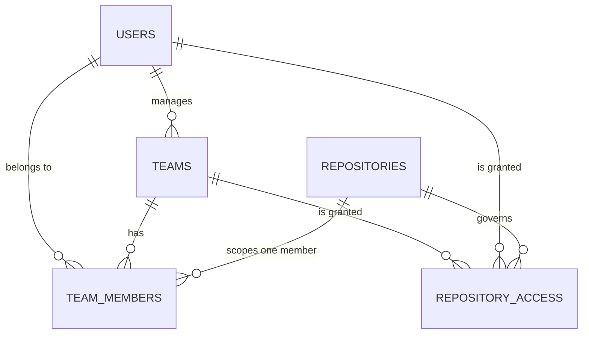

# Database Schema

PostgreSQL 16 · SQLAlchemy 2.0 (typed `DeclarativeBase`) · Alembic migrations.

The schema is **normalised**. Commits, file changes, pull requests, issues, labels,
contributors and releases are separate tables with real foreign keys and indexes — there
is no single "repository blob" JSON column. JSON (`JSONB`) is used only where the shape
is genuinely open-ended: ML metrics, model parameters and per-prediction explanations.

Authoritative DDL: `backend/alembic/versions/0001_initial.py`.
Drift gate: `python backend/scripts/check_schema.py` compares the live schema to the ORM
and exits non-zero on any difference (run in CI).

---

## 1. Entity-relationship diagram

```mermaid
erDiagram
    USERS ||--o{ REPOSITORIES : "owns"
    USERS ||--o{ PREDICTIONS : "requests"
    USERS ||--o{ REFRESH_JOBS : "triggers"
    USERS ||--o{ ML_RUNS : "observes"

    REPOSITORIES ||--o{ COMMITS : "contains"
    REPOSITORIES ||--o{ FILE_CHANGES : "has"
    REPOSITORIES ||--o{ PULL_REQUESTS : "has"
    REPOSITORIES ||--o{ ISSUES : "has"
    REPOSITORIES ||--o{ RELEASES : "publishes"
    REPOSITORIES ||--o{ CONTRIBUTORS : "employs"
    REPOSITORIES ||--o{ ANALYTICS_SNAPSHOTS : "summarised by"
    REPOSITORIES ||--o{ REFRESH_JOBS : "ingested by"
    REPOSITORIES ||--o{ PREDICTIONS : "context for"

    COMMITS ||--o{ FILE_CHANGES : "diffstat"

    ISSUES ||--o{ ISSUE_COMMENTS : "discussed in"
    ISSUES ||--o{ ISSUE_LABEL_MAP : "tagged by"
    ISSUE_LABELS ||--o{ ISSUE_LABEL_MAP : "appears on"

    MODEL_VERSIONS ||--o{ PREDICTIONS : "produced"
    MODEL_VERSIONS ||--o{ ML_RUNS : "evaluated by"

    USERS {
        int id PK
        string email UK
        string username UK
        string hashed_password
        enum role "admin|analyst|viewer"
        bool is_active
        timestamptz last_login_at
    }

    REPOSITORIES {
        int id PK
        int owner_id FK
        string full_name "pallets/click"
        string owner_name
        string name
        string default_branch
        string language
        int stars
        int forks
        int open_issues_count
        enum sync_status
        timestamptz last_synced_at
        int ingested_commits
        int ingested_issues
    }

    CONTRIBUTORS {
        bigint id PK
        int repository_id FK
        string github_login
        int commits_count
        bigint additions
        bigint deletions
        int issues_opened
        int prs_merged
        timestamptz first_commit_at
        timestamptz last_commit_at
    }

    COMMITS {
        bigint id PK
        int repository_id FK
        string sha
        string author_login
        text message
        timestamptz authored_at
        int additions
        int deletions
        int files_changed
        bool is_merge
        bool is_bugfix
    }

    FILE_CHANGES {
        bigint id PK
        bigint commit_id FK
        string path
        string old_path
        enum change_type "added|modified|deleted|renamed"
        int additions
        int deletions
        float similarity
    }

    PULL_REQUESTS {
        bigint id PK
        int repository_id FK
        int number
        string title
        enum state "open|closed|merged"
        bool merged
        int additions
        int deletions
        int changed_files
        timestamptz created_at
        timestamptz merged_at
    }

    ISSUES {
        bigint id PK
        int repository_id FK
        int number
        string title
        text body
        enum state
        bool is_pull_request
        int comments_count
        enum category "BUG|FEATURE_REQUEST|DOCUMENTATION|QUESTION|ENHANCEMENT|OTHER"
        float category_confidence
        string priority
        float effort_hours
        timestamptz created_at
        timestamptz closed_at
    }

    ISSUE_LABELS {
        int id PK
        string name UK
        string colour
    }

    ISSUE_LABEL_MAP {
        bigint issue_id PK,FK
        int label_id PK,FK
    }

    ISSUE_COMMENTS {
        bigint id PK
        bigint issue_id FK
        string author_login
        text body
        timestamptz created_at
    }

    RELEASES {
        bigint id PK
        int repository_id FK
        string tag_name
        string author_login
        bool is_prerelease
        timestamptz published_at
    }

    MODEL_VERSIONS {
        int id PK
        string name
        int version
        string algorithm
        string mlflow_run_id
        string data_hash
        string dataset_version
        int n_train
        int n_test
        json features
        json hyperparameters
        json metrics
        json comparison
        bool is_active
        timestamptz trained_at
    }

    PREDICTIONS {
        bigint id PK
        int repository_id FK
        int user_id FK
        int model_version_id FK
        string target_type
        string model_name
        string model_version_tag
        string prediction
        float probability
        json probability_json
        string input_hash
        json explanation
        float latency_ms
    }

    ML_RUNS {
        int id PK
        string name
        string algorithm
        int model_version_id FK
        string mlflow_run_id
        string status
        string data_hash
        int dataset_rows
        float train_seconds
        json params
        json metrics
    }

    ANALYTICS_SNAPSHOTS {
        int id PK
        int repository_id FK
        string snapshot_date
        string granularity
        int commits
        int issues_opened
        int issues_closed
        int prs_merged
        int bug_fixes
        int active_contributors
        json metrics
    }

    REFRESH_JOBS {
        int id PK
        int repository_id FK
        int user_id FK
        string job_type
        string target
        enum status "queued|running|completed|failed"
        int rows_ingested
        int api_calls_made
        text error
        float duration_seconds
        timestamptz started_at
        timestamptz finished_at
    }

    TEAMS {
        int id PK
        string name
        string slug UK
        text description
        int manager_id FK "the project manager"
        bool is_active
        timestamptz created_at
        timestamptz updated_at
    }

    TEAM_MEMBERS {
        int id PK
        int team_id FK
        int user_id FK
        enum role "manager|member|viewer"
        int scoped_repository_id FK "pin to one repository; nullable"
        int invited_by_id FK
        timestamptz joined_at
    }

    REPOSITORY_ACCESS {
        int id PK
        int repository_id FK
        int user_id FK "exactly one of user_id / team_id"
        int team_id FK
        enum grant_type "user|team"
        enum permission "read|write|admin"
        int granted_by_id FK
        timestamptz expires_at "nullable; lapsed grants are ignored"
        text note
    }
```

### Access-control relationships

A grant is stored once, whether it addresses a person or a whole team, so "who can
touch this repository" is a single indexed query rather than a join across two
permission systems. `CK_REPOSITORY_ACCESS_SINGLE_SUBJECT` enforces that exactly one of
`user_id` / `team_id` is set, so a row can never be ambiguous about who it speaks for.

---

## 2. Design decisions

**Natural unique keys make ingestion idempotent.** Every fact table carries a composite
unique constraint that the real world already provides — `commits(repository_id, sha)`,
`issues(repository_id, number)`, `pull_requests(repository_id, number)`,
`releases(repository_id, tag_name)`, `contributors(repository_id, github_login)`,
`model_versions(name, version)`. Re-running the ETL performs an `INSERT … ON CONFLICT DO
UPDATE`, so a refresh updates rows in place instead of duplicating them. This is what
makes the pipeline safe to schedule.

**`issues` covers both issues and pull requests.** GitHub's REST API returns PRs from
`/issues`, and the corpus format does too. `is_pull_request` distinguishes them, so the
issue analytics (closure rate, resolution time) stay clean while nothing is lost.

**Labels are normalised into a dictionary plus a join table.** `issue_labels` is the
dictionary; `issue_label_map` is a composite-PK association object. This allows
"issues per label" as a grouped aggregate and correct handling of the same label name
across repositories, neither of which a JSON array would support.

**Enums are PostgreSQL ENUMs, persisted by value.** `issue_state`, `pr_state`,
`change_type`, `sync_status`, `job_status`, `user_role`, `issue_category`, `risk_level`,
`priority_level`. Values are stored as their readable string (`open`, not `1`), so a raw
`SELECT` is self-documenting. Python `enum.Enum` classes mirror them one-to-one.

**`model_versions` mirrors MLflow.** The MLflow store is the experiment system of record;
this table is the denormalised projection the API reads, so serving a prediction never
requires a live MLflow round-trip. `data_hash` ties every prediction to the exact
training data it came from.

**`predictions` is an append-only audit log.** Every inference records
`model_version_tag`, `input_hash` (SHA-256 of the request payload), `probability`,
`probability_json` (full distribution) and `explanation`. This makes any prediction
reproducible and auditable: given the same input hash you can find the exact model
version that served it.

**Timestamps are `TIMESTAMPTZ` throughout.** GitHub returns mixed units — ISO-8601
strings on some endpoints and epoch **milliseconds** on others. `services/ingestion.py`
normalises both; mixing naive and aware datetimes is the classic source of silent
off-by-epoch-bugs in this pipeline.

---

## 3. Indexes

| Table | Index | Purpose |
|---|---|---|
| `commits` | `(repository_id, authored_at)` | commit-trend time series |
| `commits` | `(repository_id, author_login)` | per-author filtering |
| `commits` | `is_bugfix` | defect-pressure ratio |
| `file_changes` | `commit_id` | diffstat join |
| `file_changes` | `path` | churn-hotspot aggregation |
| `issues` | `(repository_id, created_at)` | issue trends |
| `issues` | `(repository_id, state)` | open/closed counts |
| `issues` | `(repository_id, category)` | category distribution |
| `issues` | GIN `to_tsvector('english', title‖body)` | full-text search |
| `pull_requests` | `(repository_id, merged)` | merge-rate queries |
| `repositories` | `full_name` | lookup by slug |
| `contributors` | `(repository_id, commits_count)` | leaderboard ordering |
| `predictions` | `(repository_id, created_at)`, `input_hash` | audit queries |
| `analytics_snapshots` | `(repository_id, granularity, snapshot_date)` | trend reads |
| `repository_access` | `(repository_id, grant_type)` | resolving who can reach a repository |
| `repository_access` | `user_id`, `team_id` | resolving what a person can reach |
| `team_members` | `user_id` | "my teams" lookups |
| `team_members` | `(team_id, user_id)` unique | one membership per person per team |
| `teams` | `manager_id` | "teams I manage" lookups |

---

## 4. Partitioning and scale

The schema is designed to reach tens of millions of rows without redesign:

- `commits` and `file_changes` are the growth engines (a busy repo produces thousands of
  rows per day). Both are natural candidates for declarative range partitioning on
  `authored_at` once a single repository's history exceeds a few million rows.
- `predictions` grows with API traffic; monthly partitions on `created_at` keep the audit
  log queryable indefinitely.
- `issues` stays modest — thousands per repository, not millions.
- All heavy aggregations (`compute_repository_metrics`, `compute_trends`) run as SQL with
  `date_trunc`, `FILTER` and window functions, so the API never pulls raw fact tables into
  Python.

## 5. Retention and GDPR

`predictions.explanation` can echo user-supplied issue text, so both `predictions` and
`issue_comments.body` should be covered by the data-retention policy. `users.email` and
`users.github_login` are the only personal identifiers; `contributors.github_login` refers
to public GitHub handles of open-source contributors, which GitHub's own ToS permits for
public repository data.
