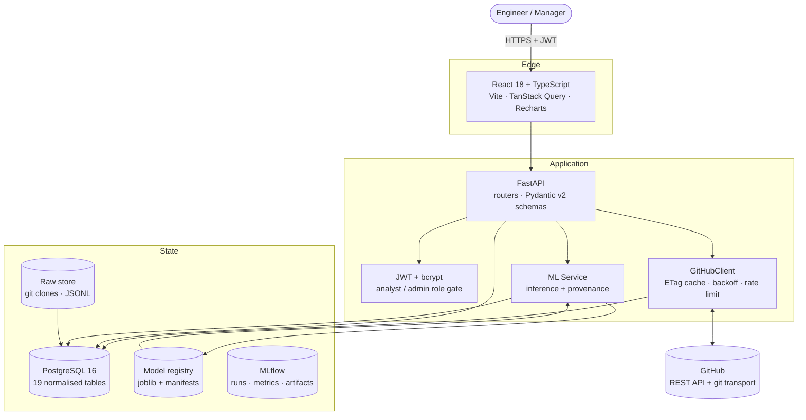
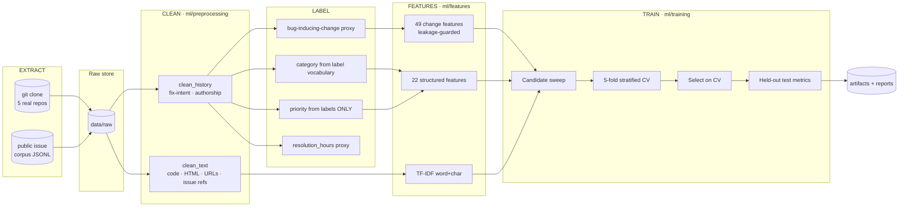
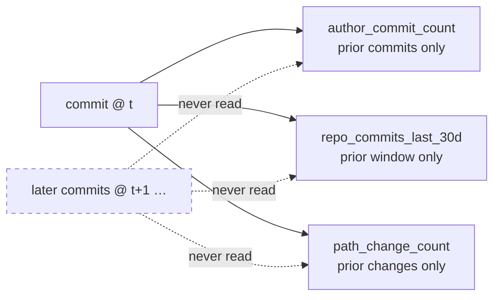
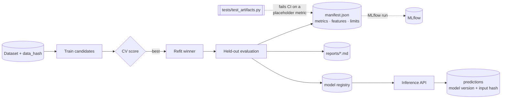
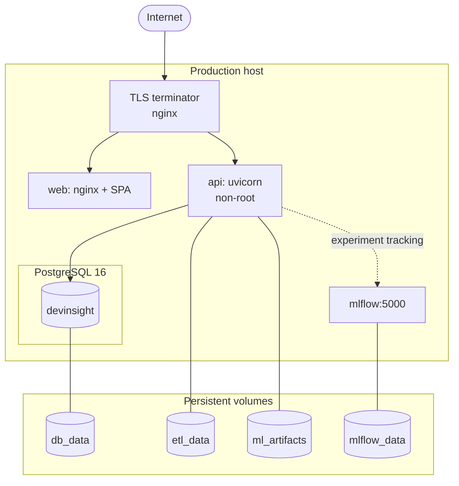

# Architecture Diagram

Mermaid source for the figures in `README.md` and `docs/ARCHITECTURE.md`.

## 1. System context

## 2. Data pipeline

## 3. Leakage guard

## 4. Model lifecycle

## 5. Deployment topology

